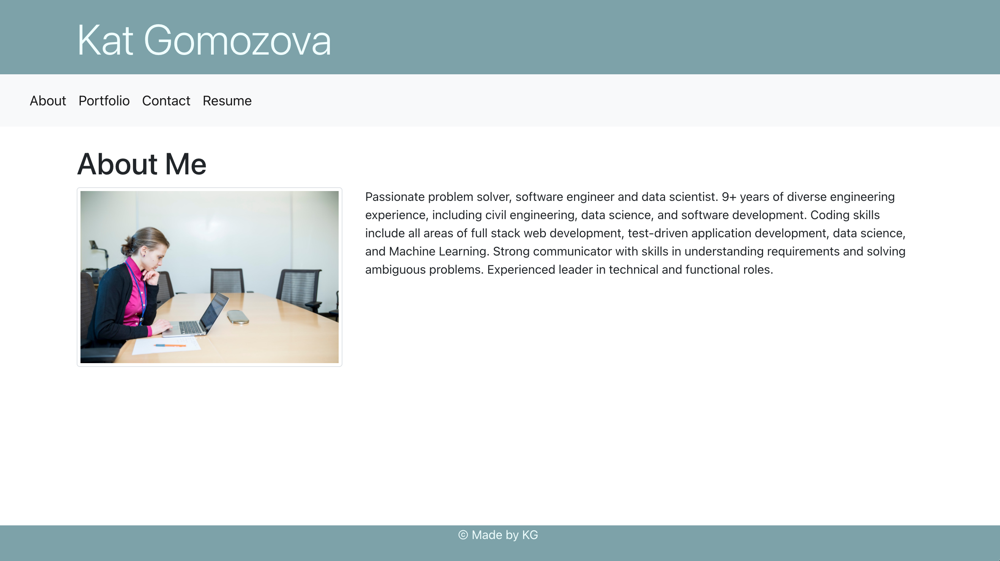
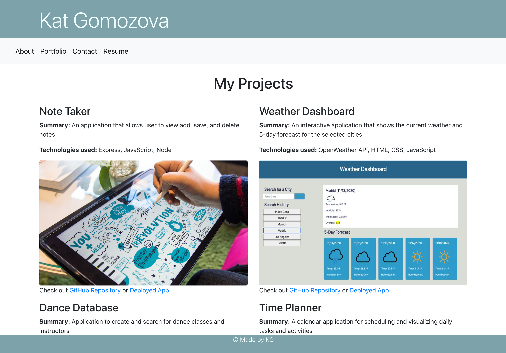
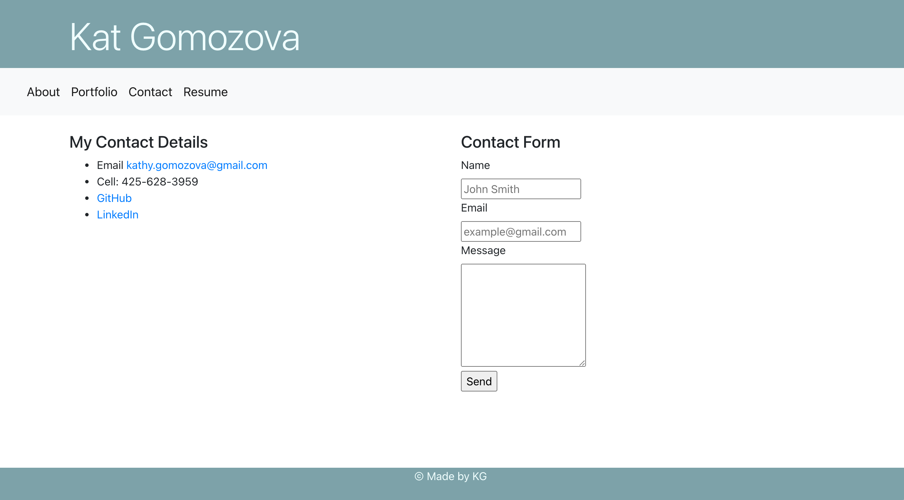

# React Portfolio

## Table of Contents
1. [ Description ](#desc)
2. [ Link to Heroku deployment ](#link)
3. [ Structure ](#structure)
4. [ Finished product ](#final)
5. [ Contact details ](#contact)

## 1. Description
This is a React portfolio page that provides a brief summary about me, my contact details and highlights some of my recent projects.  

## 2. Link to Heroku deployment 
The project is deployed on Heroku and available for view using this link:
https://react-portfolio-kat.herokuapp.com/

## 3. Structure
The frontend files are located in client/src folder. Besides the dafault react files, the repo contains components and pages folder. Pages include About Me, Portfolio and Contact. Components include Jumpotron, Navbar and Footer used in all pages, as well as Project used for rendering of the Portfolio page, and a helper Card component. Router and Switch are used for navigation between pages.

## 4. Finished product
Here are the screenshots of the application.
About Me:

Portfolio:

Contact Details:

## 5. Contact details
If you have any questions, contact me via email: 

